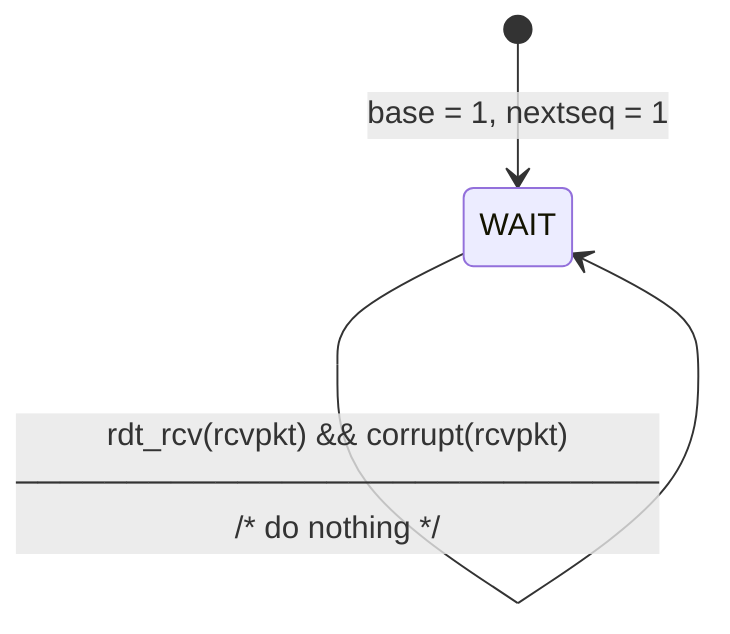

# Go-Back-N (GBN) Sender Finite State Machine (FSM)

Reference: Kurose & Ross, Computer Networking: A Top-Down Approach, Section 3.4.3.

---

## 1. State Machine Diagram

---

## 2. Invariants & State Variables

The GBN sender maintains **exactly three** state variables:
1. `base`: Sequence number of the oldest unacknowledged transmitted packet.
2. `nextseq`: Next sequence number to be assigned to outgoing application data.
3. `window` ($N$ or $W$): Window size limit representing the maximum number of unacknowledged packets permitted in flight.

**Fundamental Invariant:**
$$\text{nextseq} - \text{base} \le \text{window}$$

---

## 3. Transition Breakdown

### Transition 1: `rdt_send(data)` (Under Window Limit)
* **Trigger:** The application layer invokes `rdt_send` with a payload.
* **Guard:** $\text{nextseq} < \text{base} + N$ (`can_send() == True`).
* **Actions:**
  1. Construct packet: `sndpkt[nextseq] = make_pkt(nextseq, data, checksum)`.
  2. Send packet to network: `udt_send(sndpkt[nextseq])`.
  3. Timer check: If the window was previously empty ($\text{base} == \text{nextseq}$), start the timer for this newly sent oldest packet.
  4. Advance next sequence number: `nextseq = nextseq + 1`.

### Transition 2: `rdt_send(data)` (Window Full)
* **Trigger:** The application layer invokes `rdt_send` while $\text{nextseq} \ge \text{base} + N$ (`can_send() == False`).
* **Action:** Refuse the data or block until space becomes available. In pure logic, `SendWindow.next_seq()` raises a `RuntimeError`.

### Transition 3: `timeout`
* **Trigger:** The single sender timer expires, indicating that packet `base` was not acknowledged within the round-trip deadline.
* **Actions:**
  1. Restart the timer: `start_timer()`.
  2. Retransmit **every** packet currently in flight, from `sndpkt[base]` through `sndpkt[nextseq - 1]`.
  3. This burst retransmission gives the protocol its name: **Go-Back-N**.

### Transition 4: `rdt_rcv(rcvpkt) && notcorrupt(rcvpkt)` (Valid Cumulative ACK)
* **Trigger:** An intact packet arrives from the receiver containing cumulative ACK number $n$.
* **Actions:**
  1. Advance `base`: Since ACK $n$ confirms receipt of all sequence numbers up to and including $n$, `base` advances to $n + 1$.
  2. Timer management:
     - If all sent packets are now acknowledged ($\text{base} == \text{nextseq}$), stop the timer.
     - Otherwise, there are still unacknowledged packets in flight; restart the timer to count down for the new oldest unacknowledged packet (`base`).

### Transition 5: Corrupt Packet or Stale Duplicate ACK
* **Trigger:** A packet arrives that is either corrupted (fails checksum check) or has an ACK number strictly less than `base` ($ack < base$).
* **Action:** Discard the packet and take no action.
